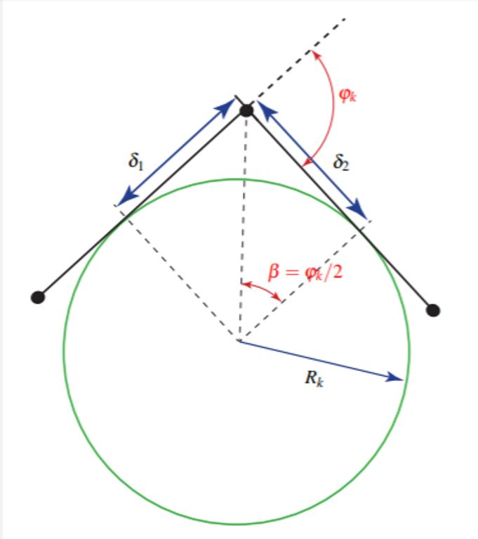
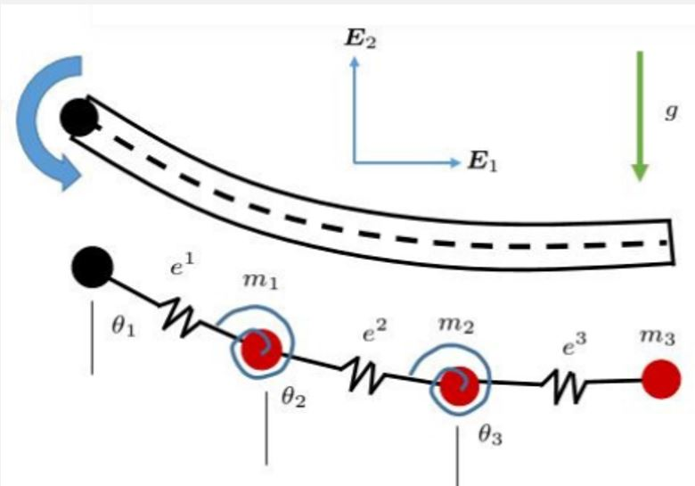
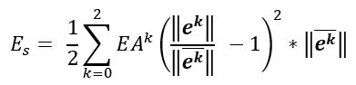
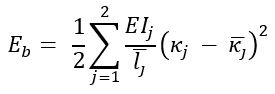
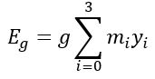

## Project Description

**Project description:** The Discrete Elastic Rod (DER) theory is one of the many approaches to model flexible bodies. Based on Kirchhoff's rod theory. Uses concepts from discrete differential geometry. Primary focus is on the planar case. 

  

  Credits: http://www.cs.columbia.edu/cg/elastic_coiling/

### 1. DER Formulation

Consider a pendulum with flexible link of mass M continuously distributed throughout the length L. If the link is rigid, the dynamics are straightforward. For a flexible link, DER formulation “discretizes” the rod into a set of-

1. N nodes each with a mass 𝑀_𝑖.
2. N-1 edges of length of length 𝐿_𝑖. 
	

  

  Figure 1.1, Jawed, M.K., Novelia, A., O’Reilly O, M.: A Primer on the Kinematics of Discrete Elastic Rods. [1]

Predicted model is close to the theoretical model (Based on Euler’s classical theory of elasticity) for higher values of N. The Mass is assumed to be concentrated at nodes, with the links being massless. A given node ‘i’ is only affected by its immediate neighbors. (Nodes i-1 and i+1).

### 2.PDER Theory
Twisting about the center line is neglected. A set of links can only stretch and/or bend in a plane. (assume this to be the x-y plane)

  

	  is the edge vector from node k-1 to node k. The unit vector is-

	

For simplicity, we assume N=4 (4 nodes and 3 links). The 3 links can independently stretch along their center line. Hence, the linear strain is given by-

	strain =  

Next we quantify the bending between adjacent links-

	 
	 
	where-  
	  = turning angle at node k  
	 = curvature at node k  

  

As mentioned before, mass is concentrated at each vertex. Let 𝑚_𝑘 be the mass of vertex k. 𝑚_𝑘=𝑎𝑣𝑒𝑟𝑎𝑔𝑒 𝑜𝑓 𝑡ℎ𝑒 𝑚𝑎𝑠𝑠𝑒𝑠 𝑜𝑓 𝑡ℎ𝑒 𝑡𝑤𝑜 𝑒𝑑𝑔𝑒𝑠 𝑚𝑒𝑒𝑡𝑖𝑛𝑔 𝑎𝑡 𝑣𝑒𝑟𝑡𝑒𝑥 𝑘.

	 
	 
	 
	 

### 3. Potential Energy of the System

The Discrete elastic model is further simplified by constructing the 4-node model with-
1. Linear springs representing the edges.
2. Non-linear torsional springs at the nodes.

  

The total potential energy of the system is comprised of the stretching energy, the bending energy and gravitational energy. Elastic stretching energy as a function of elastic strain-

	

Bending energy as a function of the curvature-

	

	where- 
	 
	 

Finally, the gravitational potential energy is given by-

	

### 4. Trajectory planning and control

The approach to trajectory control is to calculate a optimised path to the destination using the Hamilton-Jacobi-Bellman equation and then then develop a position-based feedback control to keep the snake on the path. With simplicity and time frame in mind, motion planning is done in a static environment. The position feedback can be a overhead camera that is trained to track the centre of mass of the robot. 

